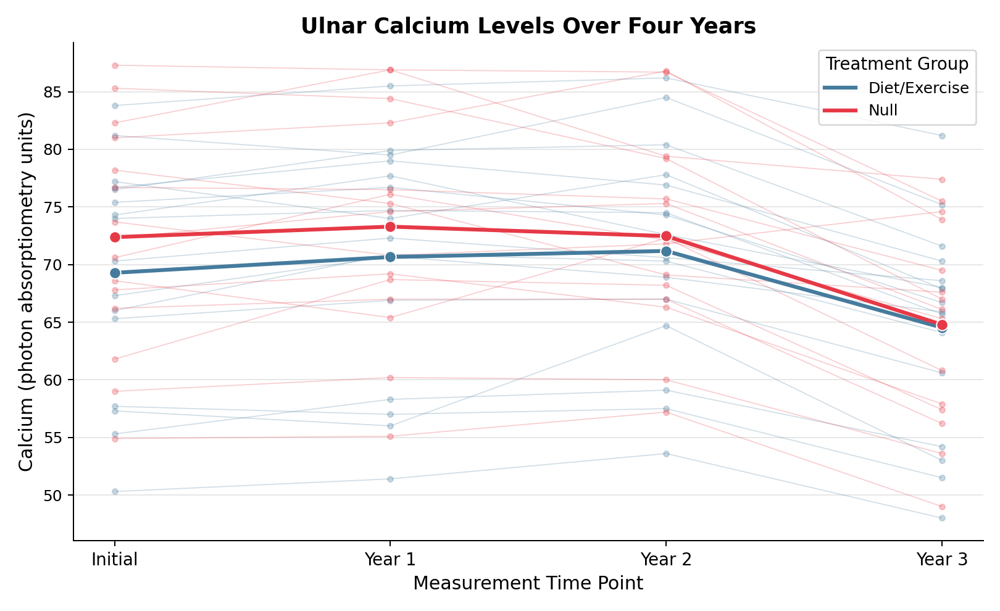
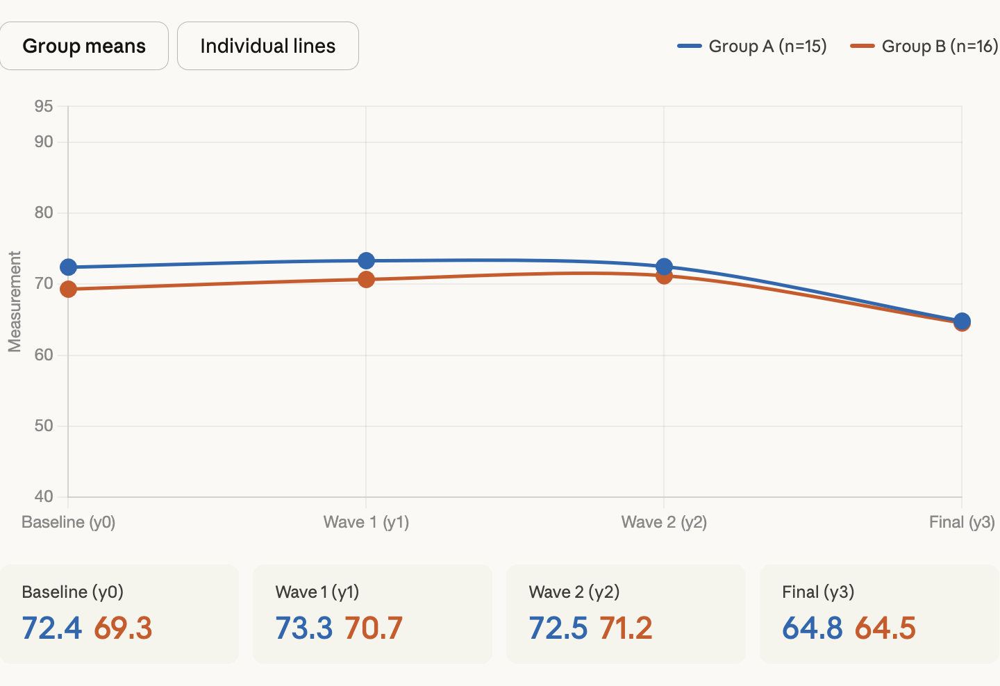

```{r}

#| label: loadPackages
# Coding Style: This document follows the Tidyverse Style Guide
# (https://style.tidyverse.org/). The style is applied consistently
# across every code chunk in this QMD.
# Load Packages ----
library(tidyverse)
library(rvest)
library(knitr)
library(kableExtra)
library(scales)

```

# Busiest Passenger Airports Analysis

## Plan

### Goal

The goal of this analysis is to scrape passenger traffic data from the Wikipedia page listing the busiest airports for the years 2020--2025, wrangle and tidy the data for our six selected airports (ATL, FRA, PKX, IST, DXB, DFW), create a comparison table showing passenger counts by airport and year, and create a plot showing how passenger traffic changed over time for each airport.

### Needs (Nouns and Verbs)

#### Nouns

-   The Wikipedia page listing the busiest airports by passenger traffic (data source)

<!-- -->

-   Raw HTML tables for each year (2020--2025) scraped from the page

<!-- -->

-   A combined data frame of all six years of passenger traffic

<!-- -->

-   A filtered and cleaned data frame for our six airports

<!-- -->

-   A wide-format table suitable for display

<!-- -->

-   A scatter plot with color-coded points for each airport

<!-- -->

-   Packages: \`{tidyverse}\`, \`{rvest}\`, \`{knitr}\`, \`{kableExtra}\`

#### Verbs

-   Scraping data from the web (\`read_html\`, \`html_elements\`, \`html_table\`)

-   Adding year columns to each table (\`mutate\`)

-   Combining multiple data frames (\`bind_rows\`)

-   Filtering rows for specific airports (\`filter\`, \`grepl\`)

-   Selecting and renaming columns (\`select\`, \`rename\`)

-   Parsing character strings as numbers (\`parse_number\`)

-   Reshaping data from long to wide format (\`pivot_wider\`)

-   Creating a formatted table (\`kable\`, \`kable_classic\`)

-   Creating a scatter plot (\`ggplot\`, \`geom_point\`)

-   Adding plot labels and theme (\`labs\`, \`theme_bw\`)

### Steps

1\. Load packages \`{tidyverse}\`, \`{rvest}\`, \`{knitr}\`, \`{kableExtra}\`

2\. Scrape the Wikipedia page using \`read_html()\` and \`html_elements()\` and \`html_table()\`

3\. Check the scraped list to identify which tables correspond to which years

4\. Extract the relevant tables (tables 2--7 for years 2025--2020)

5\. Add a year column to each table using \`mutate()\`

6\. Bind all years together using \`bind_rows()\`

7\. Filter for our six airports using their IATA codes (ATL, FRA, PKX, IST, DXB, DFW) using \`grepl()\`

8\. Select needed columns (Airport, Code, Total passengers) and rename columns for clarity using \`rename()\`

9\. Parse the passenger numbers as numeric using \`parse_number()\`

10\. Create a wide-format comparison table using \`pivot_wider()\`, \`kable()\`, and \`kable_classic()\`

11\. Create a comparison plot using \`ggplot()\` and \`geom_point()\`

12\. Add labels and apply \`theme_bw()\`

```{r}
#| label: scrapeAirportData

# Busiest Passenger Airports Data Wrangling ----

## Scrape and tidy passenger traffic data for six airports (2020-2025)


# Step 2: Scrape Data ----
airportRawList <- read_html(
  x = "https://en.wikipedia.org/wiki/List_of_busiest_airports_by_passenger_traffic"
) |>
  html_elements(css = "table") |>
  html_table()


# Step 3: Extract tables for each year ----
## Table 1 = 2025, Table 2 = 2024, Table 3 = 2023,
## Table 4 = 2022, Table 5 = 2021, Table 6 = 2020

raw2025 <- airportRawList[[1]]
raw2024 <- airportRawList[[2]]
raw2023 <- airportRawList[[3]]
raw2022 <- airportRawList[[4]]
raw2021 <- airportRawList[[5]]
raw2020 <- airportRawList[[6]]

# Step 4: Add year column to each table ----

raw2025 <- raw2025 |> mutate(Year = 2025)
raw2024 <- raw2024 |> mutate(Year = 2024)
raw2023 <- raw2023 |> mutate(Year = 2023)
raw2022 <- raw2022 |> mutate(Year = 2022)
raw2021 <- raw2021 |> mutate(Year = 2021)
raw2020 <- raw2020 |> mutate(Year = 2020)

# Step 5: Combine all years together ----

airportAll <- bind_rows(raw2025, raw2024, raw2023, raw2022, raw2021, raw2020)

# Step 6: Filter for our six airports ----

airportFiltered <- airportAll |>
  filter(
    grepl("ATL|FRA|PKX|IST|DXB|DFW", `Code(IATA/ICAO)`)
  )

# Step 7: Select and clean columns ----

airportClean <- airportFiltered |>
  select(Airport, `Code(IATA/ICAO)`, Totalpassengers, Year) |>
  rename(
    Code = `Code(IATA/ICAO)`,
    Passengers = Totalpassengers
  ) |>
  
  separate_wider_delim(
    cols = Code,
    delim = "/",
    names = c("IATA", "ICAO")
  ) |>
  
  mutate(
    Passengers = parse_number(Passengers)
  ) |>
  
  select(IATA, Airport, Year, Passengers)

```



```{r}
#| label: tbl-airportPassengers
#| tbl-cap: "Passenger Traffic (Millions) for Six Busiest Airports (2020--2025)"
#| tbl-pos: H

# Create Wide-Format Passenger Table ----
## Pivot so each row is an airport, columns are years
options(knitr.kable.NA = "")

airportTable <- airportClean |>
  mutate(Passengers = round(Passengers / 1e6, 1)) |>
  select(IATA, Year, Passengers) |>
  arrange(IATA) |>
  pivot_wider(
    names_from = Year,
    values_from = Passengers
  )

# Display Formatted Table ----
## Alternating row colors for readability, footnote for context
airportTable |>
  kable(
    align = "lcccccc",
    booktabs = TRUE,
    linesep = ""
  ) |>
  kable_classic(
    font_size = 14
  ) |>
  row_spec(
    row = seq(2, nrow(airportTable), 2),
    background = "#F0F0F0"
  ) |>
  footnote(
    general = "Values represent total annual passengers in millions.",
    footnote_as_chunk = TRUE
  )
```

```{r}
#| label: fig-airportTrend
#| fig-cap: "Passenger traffic trends at six major airports, 2020--2025"
#| fig-alt: "Scatter plot with connecting lines showing passenger traffic from 2020 to 2025 at six airports: ATL, DFW, DXB, FRA, IST, and PKX, with all airports showing recovery after 2020."
#| fig-pos: H

# Busiest Airports Trend Plot ----
## Scatter plot with lines showing passenger traffic over time
airportClean |>
  ggplot(mapping = aes(x = Year, y = Passengers, color = IATA)) +
  geom_point(size = 3) +
  geom_line(linewidth = 0.8) +
  scale_y_continuous(labels = comma) +
  labs(
    x = "Year",
    y = "Total Passengers",
    color = "Airport"
  ) +
  theme_bw()
```

## Analysis

As shown in @tbl-airportPassengers and @fig-airportTrend, all six airports show a strong upward trend in passenger traffic from 2020 to 2025, likely reflecting their recovery from the COVID-19 pandemic. In 2020, all airports had their lowest numbers, with ATL at around 42.9 million and IST at around 23.3 million. By 2025, ATL reached over 106 million and IST grew to over 84 million. DXB and IST show the sharpest growth, going from some of the lowest numbers in 2020 to being among the top airports by 2025. Part of IST's rapid growth could be explained by the fact that Istanbul Airport opened in 2018 and serves as a major hub for transit flights between Europe and Asia, which likely contributed to its increasing traffic. However, ATL and DFW show a slight decrease from 2024 to 2025, with ATL going from 108 million to 106 million and DFW from 87 million to 85 million, as seen in both @tbl-airportPassengers and @fig-airportTrend. FRA has the slowest recovery among the six, staying around 63 million in 2025. PKX has missing data for 2020, 2022, and 2023 since it was not in the top 50 busiest airports during those years, but it appears in 2024 and 2025 with around 49 and 53 million passengers. Overall, every airport recovered from the pandemic, but their growth rates and current traffic levels are quite different.



# Monte Carlo Numeric Integration

## Plan

### Goal

The goal is to estimate the definite integral of the Weibull probability density function (shape = 1.5, scale = 1) over the interval from 0 to 4 using Monte Carlo simulation at four resolutions (n = 10, 100, 1000, 10000), and create a small multiple plot showing how the estimate improves as the number of simulated points increases.

### Needs (Nouns and Verbs)

#### Nouns

-   The Weibull probability density function: `dweibull(x, shape = 1.5, scale = 1)`
-   The x bounds (0 to 4) and y bounds (0 to 0.8) for the rectangular window
-   The area of the rectangular window
-   A custom R function for generating random (x, y) coordinate pairs
-   Data frames of randomly generated coordinate pairs at four resolutions
-   A flag variable indicating whether each point is above or on/below the curve
-   Four scatter plots at different resolutions (n = 10, 100, 1000, 10000)
-   A small multiple plot arranged in a 2x2 grid
-   Packages: `{tidyverse}`

#### Verbs

-   Defining the coordinate generator function (`function`, `runif`)
-   Setting a seed for reproducibility (`set.seed`)
-   Generating random coordinates for each resolution (`generateCoords`)
-   Flagging points as above or on/below the curve (`mutate`, `if_else`)
-   Calculating the proportion of points on/below the curve (`sum`, `nrow`)
-   Multiplying proportion by window area to estimate the integral
-   Creating scatter plots with colored points (`ggplot`, `geom_point`)
-   Drawing the Weibull curve on each plot (`stat_function`)
-   Adding labels and theme (`labs`, `theme_bw`)

### Steps

1.  Load packages `{tidyverse}`
2.  Define the Weibull function bounds: x from 0 to 4, y from 0 to 0.8
3.  Calculate the area of the rectangular window (4 × 0.8 = 3.2)
4.  Create a custom function `generateCoords()` that generates random (x, y) pairs using `runif()`
5.  Use `set.seed(184)` for reproducibility
6.  Generate coordinate pairs at four resolutions: n = 10, 100, 1000, 10000
7.  For each resolution, flag points as on/below or above the Weibull curve using `mutate()` and `if_else()`
8.  Calculate the proportion of on/below points and multiply by the window area to estimate the integral
9.  Create a scatter plot for each resolution using `ggplot()` and `geom_point()`, with the Weibull curve overlaid using `stat_function()`
10. Add labels including the estimated integration value using `labs()` and apply `theme_bw()`
11. Arrange the four plots into a 2x2 small multiple using Quarto sub-figures with `layout-ncol: 2`

```{r}
#| label: generateCoords

# Monte Carlo Coordinate Generator ----
## Generate random (x, y) pairs within user-defined bounds
generateCoords <- function(xMin, xMax, yMin, yMax, n) {
  xCoords <- runif(n = n, min = xMin, max = xMax)
  yCoords <- runif(n = n, min = yMin, max = yMax)
  coords <- data.frame(x = xCoords, y = yCoords)
  return(coords)
}
```

```{r}
#| label: fig-monteCarlo
#| fig-cap: "Monte Carlo Integration of the Weibull Distribution at Four Resolutions"
#| fig-subcap:
#|   - "n = 10 points"
#|   - "n = 100 points"
#|   - "n = 1,000 points"
#|   - "n = 10,000 points"
#| fig-alt:
#|   - "Scatter plot of 10 random points with Weibull curve, showing sparse coverage and rough integration estimate."
#|   - "Scatter plot of 100 random points with Weibull curve, showing improved coverage and closer estimate."
#|   - "Scatter plot of 1000 random points with Weibull curve, showing dense coverage and accurate estimate."
#|   - "Scatter plot of 10000 random points with Weibull curve, showing very dense coverage and estimate near 1."
#| layout-ncol: 2
#| fig-pos: H

# Monte Carlo Simulation and Plots ----
## Weibull PDF: dweibull(x, shape = 1.5, scale = 1)
## x bounds: 0 to 4, y bounds: 0 to 0.8

windowArea <- (4 - 0) * (0.8 - 0)
resolutions <- c(10, 100, 1000, 10000)

set.seed(184)

for (n in resolutions) {
  # Generate coordinates ----
  mcData <- generateCoords(xMin = 0, xMax = 4, yMin = 0, yMax = 0.8, n = n)
  
  # Flag points as above or on/below ----
  mcData <- mcData |>
    mutate(
      flag = if_else(
        condition = y <= dweibull(x, shape = 1.5, scale = 1),
        true = "on/below",
        false = "above"
      )
    )
  
  # Calculate estimated integration ----
  proportion <- sum(mcData$flag == "on/below") / nrow(mcData)
  estimate <- windowArea * proportion
  
  # Create plot ----
  p <- ggplot() +
    geom_point(
      data = mcData,
      mapping = aes(x = x, y = y, color = flag),
      size = 1
    ) +
    stat_function(
      fun = dweibull,
      args = list(shape = 1.5, scale = 1),
      xlim = c(0, 4),
      linewidth = 1
    ) +
    labs(
      x = "x",
      y = "y",
      color = "Position",
      caption = paste("Est. Integration:", round(estimate, 4))
    ) +
    theme_bw()
  
  print(p)
}
```

## Analysis

@fig-monteCarlo illustrates how the Monte Carlo estimate of the Weibull distribution integral improves as the number of simulated points increases. With only 10 points (@fig-monteCarlo-1), the estimate is unreliable because there are too few points to accurately represent the area under the curve. As we increase to 100 points (@fig-monteCarlo-2) and then 1,000 points (@fig-monteCarlo-3), the estimates converge closer to the true value. At 10,000 points (@fig-monteCarlo-4), the points are densely packed and the boundary between the on/below and above regions closely follows the Weibull curve, yielding an estimate very close to 1. Since the Weibull distribution with shape 1.5 and scale 1 is a probability density function, its integral from 0 to infinity equals exactly 1. Our bounds of 0 to 4 capture nearly all of the area under the curve, so the true integral over this range is very close to 1. The small multiple confirms this reasoning: as resolution increases, the estimates consistently approach a value near 1.



# Planning and Prompting GenAI Tools

## Plan

### Goal

The goal is to clean up the calcium.csv dataset, which holds information on ulnar calcium measurements taken over four years from a longitudinal study of 31 females, and make a graph that aids in analyzing the differences in ulnar calcium levels over time between the control group (which includes 15 females without any treatment) and the experimental group (consisting of 16 females with dietary and exercise treatment).

### Needs (Nouns and Verbs)

#### Nouns

-   The calcium.csv file with 8 columns: first 4 columns are the null treatment group (Initial, Year 1, Year 2, Year 3), last 4 columns are the diet/exercise group (Initial, Year 1, Year 2, Year 3)
-   31 women total: 15 in null group, 16 in diet/exercise group
-   Four measurement time points: Initial, Year 1, Year 2, Year 3
-   Ulnar calcium measurements from photon absorptiometry
-   A tidy data frame with columns: Subject, Group, Time, Calcium
-   A line plot comparing the two treatment groups over time
-   Packages: `{tidyverse}`

#### Verbs

-   Reading the CSV file (`read_csv`)
-   Separating the null group columns (first 4) from the diet/exercise group columns (last 4) (`select`)
-   Adding a Group column to identify treatment ("Null" vs "Diet/Exercise") (`mutate`)
-   Adding Subject IDs to each woman (`mutate`, `row_number`)
-   Pivoting from wide to long format so Time becomes a single column (`pivot_longer`)
-   Combining both group subsets (`bind_rows`)
-   Creating a visualization comparing groups over time (`ggplot`, `geom_line`, `geom_point`)
-   Adding labels and theme (`labs`, `theme_bw`)

### Steps

1.  Load `{tidyverse}`
2.  Read calcium.csv using `read_csv()`
3.  Separate the first 4 columns (null treatment group) into their own data frame
4.  Separate the last 4 columns (diet/exercise treatment group) into their own data frame
5.  Add a Subject ID column to each data frame using `row_number()`
6.  Add a Group column: "Null" for the first subset, "Diet/Exercise" for the second subset
7.  Rename columns in both subsets to consistent names: Initial, Year 1, Year 2, Year 3
8.  Pivot each subset from wide to long format using `pivot_longer()` so that Time becomes a column and Calcium becomes the measurement column
9.  Combine both subsets into one tidy data frame using `bind_rows()`
10. Verify the tidy data has columns: Subject, Group, Time, Calcium
11. Create a line plot with Time on the x-axis, Calcium on the y-axis, colored by Group, with individual subject lines to show trends within each group
12. Add appropriate labels using `labs()` and apply `theme_bw()`

## Plan-Informed Response

I provided the above plan along with the calcium.csv file to Anthropic Claude (Claude Opus 4.6 Extended Thinking, April 15, 2026). The plan itself served as the prompt, instructing the tool to tidy the data and create the described visualization.

Claude proceeded with the steps according to the guide and wrote code for R which split the two groups of treatments, assigned subject IDs and Groups to each group, made the data set into long format, merged the data, and plotted a graph of the individual trends in relation to the mean for both groups. The application was able to detect the first four columns as belonging to the Null group and the last four columns as belonging to the Diet and Exercise group.The resulting plot is shown in @fig-calciumPlan.

{#fig-calciumPlan fig-alt="Line plot showing ulnar calcium levels over four years for null and diet/exercise groups, with individual subject lines and bold group mean lines." width="85%"}

## Generic Response

The following response was generated by Anthropic Claude (Claude Sonnet 4.6 Extended, March 31, 2026) when given only a generic prompt without any plan or context. The prompt used was: "Create a data visualization that will help me understand these data." along with the calcium.csv file.

The output of the tool included two graphs, the first graph presenting the mean of each group (@fig-calciumGeneric1), while the second graph illustrated the trends of each individual (@fig-calciumGeneric2). In its reply, the tool pointed out that there is a common trend within both groups, where their values were initially steady for the first three waves and then significantly dropped in the last wave. According to the tool, Group A began with a higher baseline than Group B, with mean values of approximately 72.4 and 69.3, respectively, but the mean value in both groups was almost equal in the end, about 64.8 and 64.5.

{#fig-calciumGeneric1 fig-alt="Line plot from generic Claude response showing group means for Group A and Group B across four time points, with both groups declining at the final wave." width="85%"}

{#fig-calciumGeneric2 fig-alt="Line plot from generic Claude response showing individual subject trajectories for Group A and Group B, with substantial variation within each group." width="85%"}

\FloatBarrier

## Comparison

Results of the plan-informed response (@fig-calciumPlan) compared to the generic response (@fig-calciumGeneric1 and @fig-calciumGeneric2) uncovers several notable differences. First and foremost, the context understanding was significantly different between the two prompts. While the prompt with a plan informed the tool that the data were split into two groups, "Null" and "Diet/Exercise," and that three points in time had to be considered as "Initial," "Year 1," "Year 2," and "Year 3," the generic prompt did not provide enough information on the context of the data and therefore assigned the columns generic labels "Group A" and "Group B" and time points "Baseline (y0)" and "Wave 1 (y1)." Although such labels are correct, they do not inform the reader of the groups' names and characteristics nor of the time points' significance.

Secondly, the visualizations have been generated in a different way. While the plan-informed response returned a single visualization in R, the generic response required two interactive views to be opened separately. The user will have to navigate through them separately to compare the differences.

Based on my personal experience with creating data manipulation codes during this course, it is clear to me that having information regarding the data structure and particularly knowing that the first four columns refer to the null group and the last four columns to the diet/exercise group will be crucial to create an informative plot. If this information is not available, as seen in the generic prompt, the application cannot create labels and put emphasis on the specific hypothesis behind the experiment, which focuses on the effect of diet/exercise on ulnar calcium content.

What can be learned from this exercise is that when dealing with genAI technology, presenting the process with a well-defined plan will yield much more valuable results than giving a general request. Not only does planning help to improve human work, but it also helps to improve AI-generated content.



# Self Reflection

When I started this course, I did not know much about R. I only knew what it was used for and that it was not a hard language to learn. Since I already had coding experience with JavaScript, React, PHP, and Python, I thought learning R would be a similar experience to what I was used to.

Right now, I think I have learned much more in this course than I expected to. At the beginning, I thought the content would stay on the surface because I did not really know what the course would cover. However, this course taught me the principles a data scientist should follow, how to set goals in order to work more effectively, how to make plans, how to think in a more algorithmic way, and most importantly, how to use R as a proper tool to clean different "problematic" data and turn it into something useful for different fields or for ourselves.

The hardest thing for me in this course was actually making a plan. I am usually someone who builds a rough outline in my head (sometimes, not even that) and then just goes with the flow while developing something. In the apps I have built in the past (and still build today), and even in my semi-professional video and cinematography work, I have always put my creativity first. I usually keep only a few main points in my head and come up with solutions as new situations show up, instead of making a detailed plan in advance. This course taught me that, even if I do not have to give up this habit completely, there are times when making a plan and especially deciding on the final goal first is really helpful. Planning is a way to deal with getting lost, getting confused, or (the problem I have the most) losing focus. For example, when I am thinking about how to fix one problem, I often notice another small issue and end up stuck on it for hours. I saw a clear example of this while working on this assignment. When I scraped the Wikipedia airport data, the table numbers were not what I expected. My first reaction was to start changing the code right away, but because I already had a clear plan, I was able to stop, figure out the real problem (the page had changed so that Tables 1–6 now held the data instead of Tables 2–7), and fix it without getting lost in other small issues. I believe this way of thinking is the most valuable thing I got from this course, and I am sure the skills I learned here will keep helping me throughout my career.



# GenAI Usage Appendix

## Usage 1: Alt Text and Long Description for Busiest Airports Plot

-   **Tool:** ASU Image Accessibility tool (running GPT-4o)
-   **Date:** March 28, 2026
-   **Prompt:** Image of the Busiest Airports scatter plot uploaded to the ASU Image Accessibility tool, requesting both alt text and long description.
-   **Response:**
    -   *Alt text:* "Scatter plot showing passenger traffic from 2020 to 2025 at six airports: ATL, DFW, DXB, FRA, IST, PKX, with varying trends."
    -   *Long description:* "The image is a scatter plot chart illustrating passenger traffic at six major airports from the years 2020 to 2025. The x-axis represents the years, ranging from 2020 to 2025, while the y-axis shows the total number of passengers, from 30 million to 90 million. Each data point represents passenger numbers for an airport in a specific year, with different colors corresponding to different airports. The airports included are ATL (red), DFW (brown), DXB (green), FRA (blue), IST (teal), and PKX (pink). The scatter plot reveals variations in passenger traffic over the specified years, with some airports showing an upward trend while others fluctuate lightly. The legend on the right-hand side clearly identifies the color assigned to each airport. The source of the data is noted at the bottom: Wikipedia - List of busiest airports by passenger traffic."
    -   The output was manually checked and refined before being incorporated into the figure's `fig-alt` attribute in this document.

## Usage 2: Alt Text and Long Description for Monte Carlo Small Multiple

-   **Tool:** ASU Image Accessibility tool (running GPT-4o)
-   **Date:** March 28, 2026
-   **Prompt:** Image of the Monte Carlo small multiple plot uploaded to the ASU Image Accessibility tool, requesting both alt text and long description.
-   **Response:**
    -   *Alt text:* "Four scatter plots showing Monte Carlo integration of the Weibull distribution at resolutions n=10, 100, 1000, 10000. Red points are above the curve; teal are on or below."
    -   *Long description:* "The image consists of four scatter plots arranged in a 2x2 grid. Each plot demonstrates Monte Carlo numerical integration of the Weibull distribution at varying resolutions: n=10, n=100, n=1000, and n=10000. Each plot features a black curve representing the Weibull distribution. Points are colored either red or teal, indicating whether they lie above the curve (above) or on or below the curve (on/below). The top-left plot (n=10) displays a sparse arrangement of points, with several red points above the curve and a few teal points on or below the curve. The top-right plot (n=100) has more numerous points with a similar red and teal distribution pattern. The bottom-left plot (n=1000) shows a more densely populated area of points, with red and teal points clearly divided by the black curve. The bottom-right plot (n=10000) has a very high concentration of points. A clear boundary between red and teal points closely follows the distribution curve. Each plot has axes labeled x and y, and an estimated numerical integration value at the bottom (ranging from 0.96 to 1.024). A legend distinguishes the meanings of red and teal points."
    -   The output was manually checked and refined; in the QMD, individual sub-figure alt texts were written based on this combined long description so that each resolution panel has its own descriptive `fig-alt` attribute.

## Usage 3: Plan-Informed Calcium Analysis

-   **Tool:** Anthropic Claude (Claude Opus 4.6 Extended Thinking)
-   **Date:** April 15, 2026
-   **Prompt:** The full plan from the Planning and Prompting GenAI Tools section was provided as the prompt, along with the `calcium.csv` file. The exact text submitted was:

> Goal: The goal is to clean up the calcium.csv dataset, which holds information on ulnar calcium measurements taken over four years from a longitudinal study of 31 females, and make a graph that aids in analyzing the differences in ulnar calcium levels over time between the control group (which includes 15 females without any treatment) and the experimental group (consisting of 16 females with dietary and exercise treatment).
>
> Needs: Nouns: The calcium.csv file with 8 columns (first 4 columns are the null treatment group: Initial, Year 1, Year 2, Year 3; last 4 columns are the diet/exercise group: Initial, Year 1, Year 2, Year 3); 31 women total (15 in null group, 16 in diet/exercise group); four measurement time points (Initial, Year 1, Year 2, Year 3); ulnar calcium measurements from photon absorptiometry; a tidy data frame with columns Subject, Group, Time, Calcium; a line plot comparing the two treatment groups over time; packages {tidyverse}.
>
> Verbs: Reading the CSV file (read_csv); separating the null group columns from the diet/exercise group columns (select); adding a Group column to identify treatment ("Null" vs "Diet/Exercise") (mutate); adding Subject IDs to each woman (mutate, row_number); pivoting from wide to long format so Time becomes a single column (pivot_longer); combining both group subsets (bind_rows); creating a visualization comparing groups over time (ggplot, geom_line, geom_point); adding labels and theme (labs, theme_bw).
>
> Steps: 1. Load {tidyverse} 2. Read calcium.csv using read_csv() 3. Separate the first 4 columns (null treatment group) into their own data frame 4. Separate the last 4 columns (diet/exercise treatment group) into their own data frame 5. Add a Subject ID column to each data frame using row_number() 6. Add a Group column: "Null" for the first subset, "Diet/Exercise" for the second subset 7. Rename columns in both subsets to consistent names: Initial, Year 1, Year 2, Year 3 8. Pivot each subset from wide to long format using pivot_longer() so that Time becomes a column and Calcium becomes the measurement column 9. Combine both subsets into one tidy data frame using bind_rows() 10. Verify the tidy data has columns: Subject, Group, Time, Calcium 11. Create a line plot with Time on the x-axis, Calcium on the y-axis, colored by Group, with individual subject lines to show trends within each group 12. Add appropriate labels using labs() and apply theme_bw()

-   **Response:**

> R isn't installed in this environment, so I'll create the R script as a deliverable you can run locally, and generate the plot here with Python so you can see the result right away.
>
> Here's the plot and the complete R script. A few things to note about the results:
>
> Data cleaning: The CSV had duplicate column headers (y0, y1, y2, y3 repeated), so the script skips the header row, splits columns 1–4 (Null group, 15 subjects) from columns 5–8 (Diet/Exercise group, 16 subjects), drops the one row with missing values in the Null group, assigns unique Subject IDs, and pivots everything into a tidy long format with 124 rows × 4 columns (Subject, Group, Time, Calcium).
>
> What the plot shows: Faint lines trace each individual woman's trajectory, while the bold lines show group means. Both groups start at similar calcium levels, but the Null (control) group shows a steeper decline by Year 3 compared to the Diet/Exercise group — suggesting the treatment may help preserve bone calcium over time.
>
> The R script follows your step-by-step plan exactly using tidyverse functions (read_csv, select, mutate, pivot_longer, bind_rows, ggplot). Just update the file path in read_csv() to match your local setup and it should run as-is.

The accompanying R script (`calcium_analysis.R`) and the generated plot (`calcium_plot.png`) were saved to the project directory and used to produce @fig-calciumPlan in this document.

## Usage 4: Generic Calcium Response (provided by course staff)

-   **Tool:** Anthropic Claude (Claude Sonnet 4.6 Extended)
-   **Date:** March 31, 2026
-   **Prompt:** "Create a data visualization that will help me understand these data." along with the `calcium.csv` file (no plan or context provided).
-   **Response:**

> Here's what stands out in the data:
>
> Both groups follow the same pattern — values stay relatively stable across the first three waves (y0→y1→y2), then drop noticeably at the final measurement (y3). This sharp decline at y3 is the dominant signal.
>
> Group A starts slightly higher (baseline mean \~72.4 vs. \~69.3 for Group B), but both groups converge to nearly identical final values (\~64.8 and \~64.5). That convergence is interesting — Group A drops about 7.5 points while Group B drops about 4.8.
>
> There's substantial individual variation — hit the "Individual lines" toggle to see this. Some participants stay high throughout, others are consistently low, and a few show unusual trajectories (one in Group A actually rises at y3 while most fall).
>
> If you can share what the groups represent (e.g., treatment vs. control, or different diets/supplements) and what's being measured, I can dig into the statistics more precisely — things like whether the group difference at y3 is significant, or which individuals are outliers.

The two accompanying plots (`ClaudePlot1.png` showing group means and `ClaudePlot2.png` showing individual trajectories) were used to produce @fig-calciumGeneric1 and @fig-calciumGeneric2 in this document.



# Code Appendix

```{r codeAppendix}
#| ref-label: !expr knitr::all_labels()
#| echo: true
#| eval: false
```
